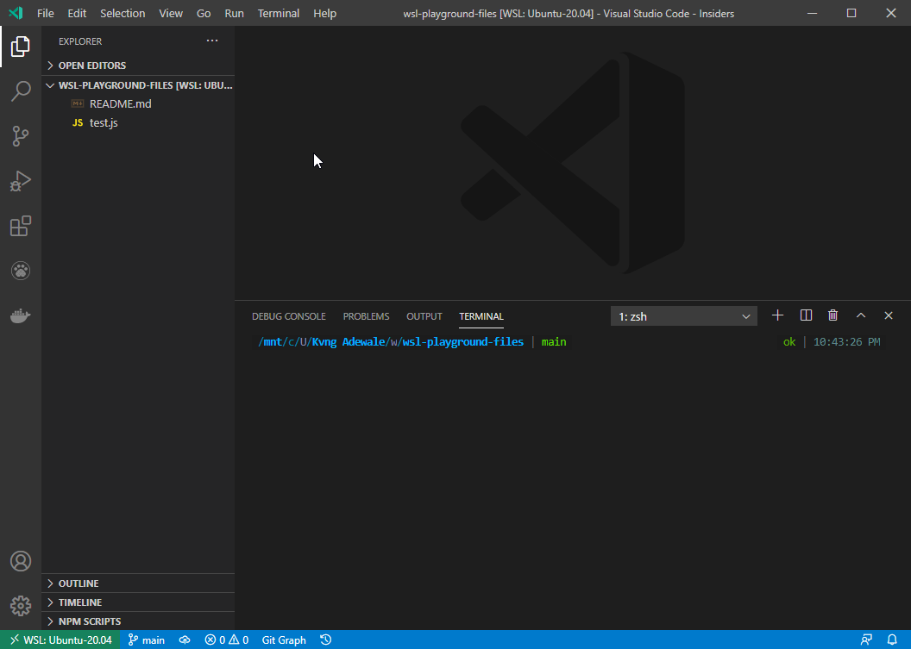
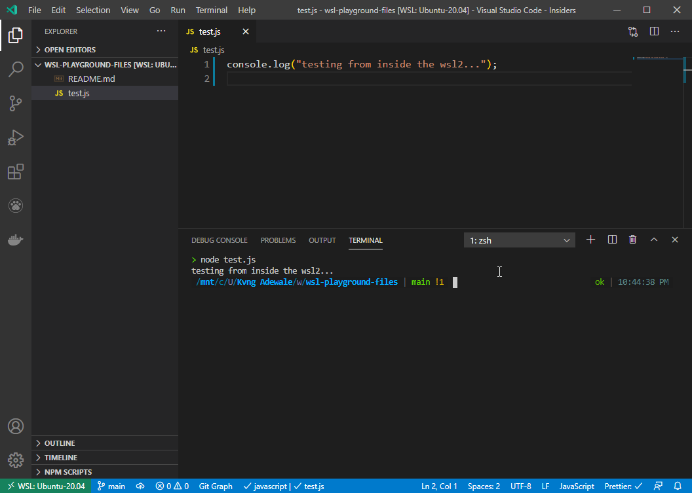

# WSL playground

- Using git from vscode & wsl
- Why you need to keep or install your programs on Ubuntu FS `~` and your project files on your Windows FS `mnt`
- Testing out git and file workflow

## Observation on working with the directory and file workflow on wsl

- I have git installed on my Windows but git is preinstalled on Ubuntu before now and how vscode could recognize which one to use should be due to the remote connection switch on vscode in my opinion like i don't really know how it can recognize `which git` to use at the background.
- Keeping my project files on the Windows FS just prove the point that you can write and read a Windows file from Ubuntu but can't do the same with the write and read of Ubuntu files from Windows.

## Fun fact

- WSL2 v WSL1

## Screenshot

